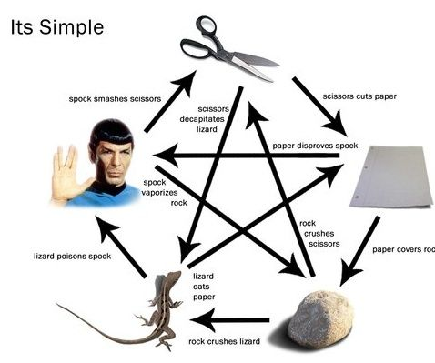

# Rock, Paper, Scissors!
  

## Week 1 School Of Code Project.
A simple game built in JavaScript that started out using prompts and alerts and basic logic and functions to return a score to another alert. 

We used event listeners to change innerText on the Dom to make the game work in the browser and be a little easier to use.

We added the extra options "Lizard and Spock" to make the game a little more interesting. 

Still need to tidy up the CSS layout of the game but it does function.

## Used
HTML
CSS
Javascript

